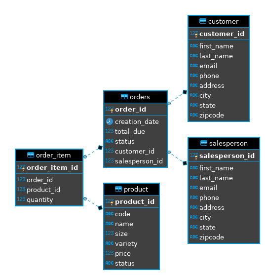

# Introduction
The JDBC application is a Java 8 implementation of CRUD (Create, Read, Update and Delete) operations on a PostgresSQL Database through the Data Access Object(DAO) design pattern. Through this project, I
* became familiar with the JDBC library,
* learned DAO and Repository design patterns.

# ER Diagram

# Design Patterns
The Data Access Object (DAO) pattern is a structural pattern that allows us to isolate the application layer from the persistence layer using an abstract API. This enables us to have a single instance of the database, having the joins being computed using the foreign keys. When we are dealing with a centralized system or multiple table joins, DAO is a great choice.

In contrast, the Repository pattern only focuses on single table accesses per class. Joins are performed in the code after all the data has been selected from the different tables. The Repository pattern is the go-to choice for developing distributed systems. 