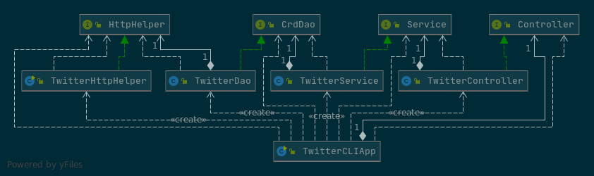

# Introduction
The Twitter CLI app is a Java 8 based application that can Post, Show and Delete Tweets from the command line. It follows the MVC design pattern, utilizing an HTTP client library to access the Twitter REST API. Developing this application required learning, JUnit, Mockito and the Spring framework for dependency management.

# Quick Start
### Running Locally
1. Ensure the following Twitter authentication variables have been set.

    Variable Name | Description
    --- | ---
    `consumerKey` | The Twitter Consumer API Key
    `consumerSecret` | The Twitter Consumer API Secret
    `accessToken` | The Twitter Access Token
    `tokenSecret` | The Twitter Access Token Secret
    Example:
    
    `$ export consumerKey='consumer_key_value'`
2. Package the application using the following Maven command.

    `$ mvn clean package`
3. Run the program in any of the following options.

    Option | Description | Return
    --- | --- | ---
    `$ java -jar [.jar file] post "tweet text" "latitude:longitude"` | Post a new tweet with specified longitude and latitude. | Posted Tweet in Json format.
    `java -jar [.jar file] show "id"` | Show a tweet based on its ID | Tweet with said ID in Json format.
    `java -jar [.jar file] delete "id1,id2,id3...` | Delete the Tweets that correspond to the following IDs. | Deleted tweets in json format.
### Running with Docker
##### Option 1: Dockerize the app
```
cd core_java/twitter

#Register Docker hub account
docker_user=your_docker_id
docker login -u ${docker_user} --password-stdin

#Pakcage the application
mvn clean package

#Build a new docker image locally
docker build -t ${docker_user}/twitter .

#Verify your image
docker image ls | grep "twitter"
```
##### Option 2: Pull an image
`docker pull brejvinder/twitter`
##### Run command
```
docker run --rm \
-e consumerKey=YOUR_VALUE \
-e consumerSecret=YOUR_VALUE \
-e accessToken=YOUR_VALUE \
-e tokenSecret=YOUR_VALUE \
${docker_user}/twitter post|show|delete [options]
```

# Design


Component | Description
--- | ---
TwitterCLIApp | The central/main part of the app. It's responsible for initializing all other components, dependencies and passing the command line input to the controller.
TwitterController | The controller is responsible for parsing the user input, ensuring the correct formatting before passing it onto the service layer.
TwitterService | The service layer handles the business logic of the DAO, ensuring the arguments are formatted correctly for the DAO before calling the DAO itself. 
TwitterDAO | The DAO is responsible for interacting directly with the Twitter REST API to create tweet models for the app.

# Models
The tweet model is the DTO used throughout the entire App. It's a Plain Old Java Object, POJO which contains various values from Twitter's Tweet object including some nested models. 

# Spring
Dependency management in this app was handled using the Spring framework. In short, it replaces the main method of the application. There were three different approaches used; `TwitterCLIBean`, `TwitterCLIComponentScan` and `TwitterCLISpringBoot`.
- `TwitterCLIBean` uses manually set `@Bean` annotations to indicate dependencies for the application context to fulfil.
- `TwitterCLIComponentScan` automatically scans the entire project for all dependencies for the application context to fulfill.
- `TwitterCLISpringBoot` uses Spring Boot's extended Spring implementation so that the extensive boilerplate from Spring isn't needed.

# Improvements
* Allow showing a tweet to input and show multiple tweets at a time.
* Allow users to retrieve a tweet with a parameter besides id
* Add attachment handling for tweets
