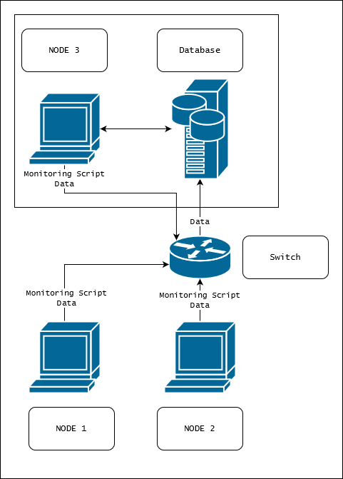

# Linux Cluster Monitoring Agent
# Introduction
The Linux Cluster Monitoring Agent is a tool that allows users to monitor nodes connected in a Linux cluster by tracking the hardware specifications and resource usage of the cluster nodes. The data is collected in real-time and is currently being used for report generation and future planning. The project consists of the following major components:
* PostgreSQL Initialization using Docker
* RDBMS Setup with SQL
* Monitoring Agent BASH Scripts

The Monitoring Agents on the nodes collect and send data to the centralized database on a scheduled basis via crontab over the network. The docker initialization and SQL scripts ensure the deployment of the RDBMS with a standardized schema and environment.

This Minimum Viable Product was tested on a single CentOS 7 Google Cloud Computing Instance instead of a 10 node/server Linux cluster. Assuming the networking and infrastructure are initialized correctly by other teams, the project will scale to multiple nodes.

# Architecture Diagram


Each node is connected through a switch and only one node has the PSQL instance. They all run the Monitoring Agent scripts and send their data over the network through the switch to the database.

# Quick Start
```bash
#Start a psql instance using psql_docker.sh
.scripts/psql_docker.sh create [db_username] [db_password]

#Create tables using ddl.sql
psql -h localhost -U [db_username] -d host_agent -f sql/ddl.sql

#Insert hardware specs data into the db using host_info.sh
./scripts/host_info.sh [psql host] [port] host_agent [db_username] [db_password]

#Insert hardware usage data into the db using host_usage.sh
./scripts/host_usage.sh [psql host] [port] host_agent [db_username] [db_password]

#Crontab setup
crontab -e

#Add the following line when the editor opens
* * * * * bash [full/path/to]/linux_sql/scripts/host_usage.sh [psql host] [port] host_agent [db_username] [db_password] &> /tmp/host_usage.log
```

# Database Modeling
The `host_agent` database contains two tables
- `host_info` which contains the hardware specifications of the host the script was run in.

Field | Description
--- | ---
`id` | Auto-incremented unique identifier for the host
`hostname` | The unique name of the host
`cpu_number` | The number of cores the CPU has
`cpu_architecture` | The architecture of the CPU
`cpu_model` | The name of the CPU model
`cpu_mhz` | The clock speed of the CPU, in MHz
`L2_cache` | The size of the L2 cache in kB
`total_mem` | The total memory in the node in kB
`timestamp` | UTC time of when these stats were taken

- `host_usage` which contains the usage specifications of the host the script was run in.

Field | Description
--- | ---
`timestamp` | UTC time of when these stats were taken
`host_id` | The ID of the corresponding host_info entry
`memory_free` | The amount of free memory in the node in MB
`cpu_idle` | The percentage of time that the CPU is idle
`cpu_kernel` | The percentage of time the CPU is running kernel code
`disk_io` | The number of disks currently undergoing I/O processes
`disk_available` | Available space in the disk's root directory in MB

## Scripts
- The `psql_docker.sh` manages the creation, starting and stopping of the of the PSQL Docker instance.
```bash
#Creating the instance
./scripts/psql_docker.sh create db_username db_password

#Starting the instance
./scripts/psql_docker.sh start

#Stopping the instance
./scripts/psql_docker.sh stop
```
- The `host_info.sh` script is run once for every node in the cluster. It collects hardware specification data and then insert the data to the database.
```bash
#Usage
./scripts/host_usage.sh psql_host psql_port db_name psql_user psql_password

#Example
./scripts/host_info.sh "localhost" 5432 "host_agent" "postgres" "mypassword"
```
- The `host_usage.sh` collects server usage data and then insert the data into the database. The script will be executed every minute using Linux crontab.
```bash
#Usage
./scripts/host_usage.sh psql_host psql_port db_name psql_user psql_password
 
#Example
./scripts/host_usage.sh localhost 5432 host_agent postgres password
```
- Automation of the `host_usage.sh` script is handled by `crontab`
```bash
#Open the chronos table
crontab -e

#Add in the following
* * * * * bash [full/path/to]/linux_sql/scripts/host_usage.sh [psql host] [port] host_agent [db_username] [db_password] &> /tmp/host_usage.log

#Validate
crontab -l
```

- The `ddl.sql` handles the creation of the tables within the database. It contains two table creation statements.
```bash
#PSQL instance must be running
psql -h localhost -U [db_username] -d host_agent -f sql/ddl.sql
```
- The `queries.sql` script contains queries to do the following
    - Group hosts by hardware info
    - Display the average memory percentage used over a 5-minute interval for each host.

## Improvements
Future improvements for the project could include the following
- Detecting node/database failure
- Additional queries
- Tracking other usage metrics
- Adding updating hardware specifications to the `host_info.sh` script
