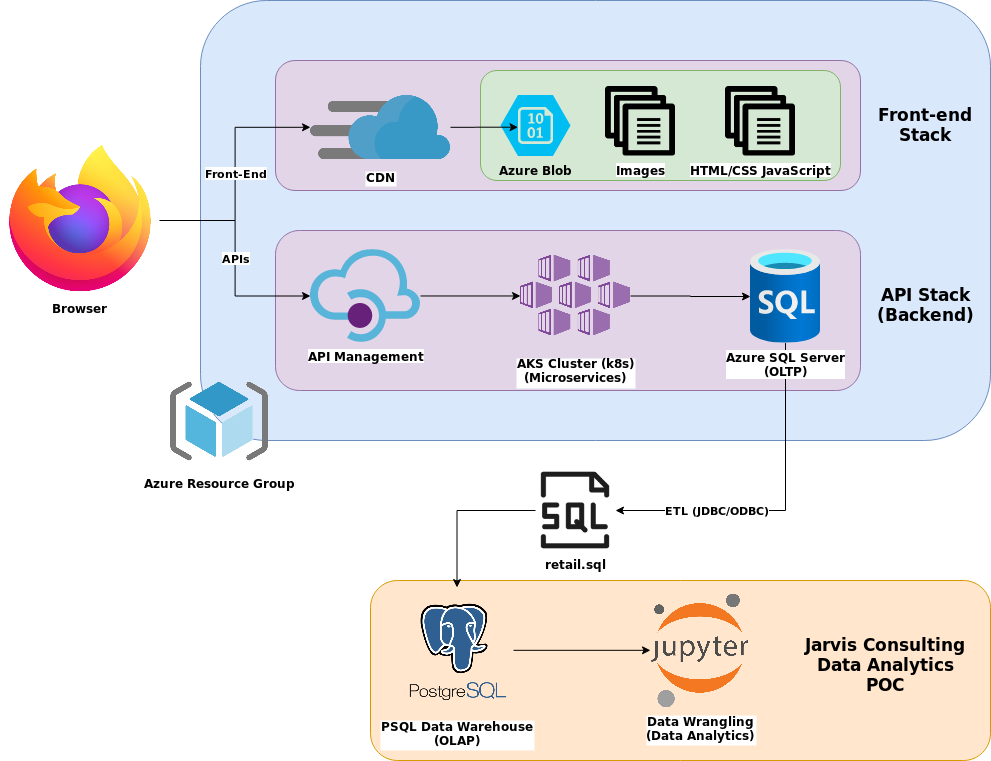

# Introduction

London Gift Shop (LGS) is a UK-based online store that sells gift-ware whose revenue has not grown in recent years. They wish to utilize data technologies to understand their customers better to develop sales and marketing specific techniques that will drive revenue up again. They lack the required infrastructure to perform this analysis themselves so
they contacted Jarvis to utilize their services.

This project is a proof of concept, POC for LGS. Data engineering techniques were used to perform business analysis. LGS compiled sample data into an SQL file for the POC which was then loaded into a denormalized PSQL database, which acts as a data warehouse for OLAP purposes. Analytics were performed in a Jupyter notebook using Python specifically Pandas Dataframes while matplotlib was used for plotting.

# Project Architecture

LGS's web app consists of a Microsoft Azure resource group. Azure's Content Delivery Network is used to manage the front-end while Azure's API Management handles the back-end. The back end is a scalable AKS cluster designed with a microservice architecture for processing and a single SQL server for OLTP data. LGS pulls its sample data from this server which was then stored in our PSQL database. The data analysis was performed in a Jupyter notebook while interfacing with the PSQL database.

# Data Analytics and Wrangling

The [Jupyter Notebook](./retail_data_analytics_wrangling.ipynb) presents the data wrangling done on the retail data provided by LGS to answer their business questions:

- Total Invoice Amount Distribution

- Monthly Placed and Cancelled Orders

- Monthly Sales

- Monthly Sales Growth

- Monthly Active Users

- Monthly New and Existing Users

- RFM Segmentation

The results of the RFM segmentation produced three major segments

1. Can't Lose

    - This segment contains customers who have previously made large purchases but have since stopped. To regain their patronage, a targeted campaign should be run for them, introducing new products similar to the ones they have previously purchased while being inline with current trends. The new products could also be targeted to make use of their previous purchases. The reason for their discontinued patronage should be investigated.

2. Hibernating

    - This segment is very similar to "Can't Lose" except they aren't major contributors. By offering this segment discounts, they may be enticed to make another purchase.

3. Champions

    - Customers in this segment are responsible for most of the revenue. Campaigns should be implemented to ensure their shopping continuity by keeping them happy with perks, discounts, gifts, etc.

# Improvements

- Consider more business questions

- Consider alternatives to RFM for measuring customer value

- Remove more data outliers