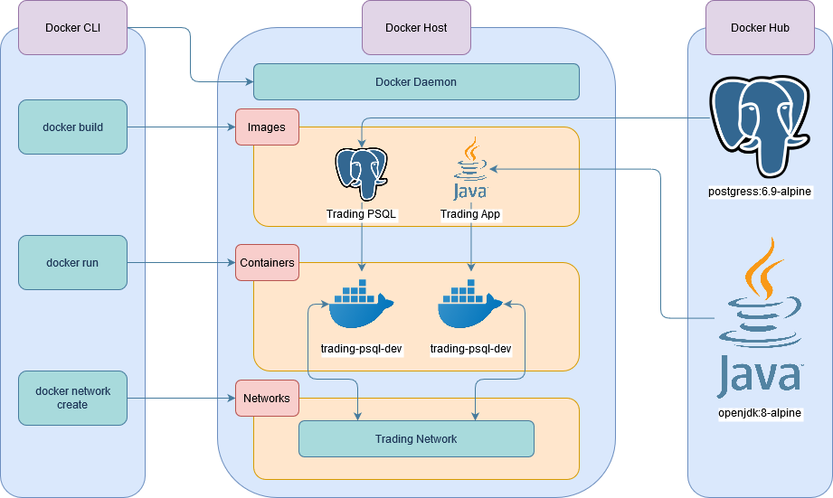

Table of contents
* [Introduction](#Introduction)
* [Quick Start](#Quick Start)
* [Architecture](#Architecture)
* [REST API Usage](#REST API Usage)
* [Docker Deployment](#Docker Deployment)

# Introduction
This application is an online stock trading simulation RESTful API that can be consumed by front-end and mobile developers, as well as traders. It retrieves stock market information and persists it into a database that can then be used to CRUD quote, trader and order data from and to the database.

The application is a Proof of Concept, PoC designed with a microservice architecture. It follows the three-tier and MVC architecture design patterns. It uses IEX Cloud as the stock information data source, SpringBoot to manage dependencies and PSQL to persist and CRUD data using DAO.
 
# Quick Start
- **Prequiresites**
    - Docker v17.05 or Higher
    - CentOS 7 or any linux distro
    - IEX Cloud Account, specifically the public key
        - Register here: https://iexcloud.io/
- **Building & Running the Application:**
    * **Build Images**
        ```bash
        cd ./springboot/psql
        docker build -t brejvinder/trading-psql .
        ```
        ```bash
        cd ./springboot/
        docker build -t brejvinder/trading-app .
        ```
    * **Alternative: Pull Images**
        ```bash
        docker pull brejvinder/trading-psql
        docker pull brejvinder/trading-app
        ```
    * **Create Docker Network**
        ```bash
        docker network create --driver bridge trading-net
        ```
    * **Start the Containers**
        ```bash
        docker run --name brejvinder-trading-psql-dev \
        -e POSTGRES_PASSWORD=password \
        -e POSTGRES_USER=postgres \
        --network trading-net \
        -d -p 5432:5432 brejvinder/trading-psql
        ```
        * **Set your IEX Public Token**
            ```bash
            IEX_PUB_TOKEN="your_token"
            ```
        
        ```bash
        docker run --name brejvinder-trading-app-dev \
        -e "PSQL_URL=jdbc:postgresql://trading-psql-dev:5432/jrvstrading" \
        -e "PSQL_USER=postgres" \
        -e "PSQL_PASSWORD=password" \
        -e "IEX_PUB_TOKEN=${IEX_PUB_TOKEN}" \
        --network trading-net \
        -p 8080:8080 brejvinder/trading-app
        ```
    * **Navigate to http://localhost:8080/swagger-ui.html in your browser**
        
    * **Stopping the Containers**
        ```bash
        docker container stop brejvinder-trading-app-dev brejvinder-trading-psql-dev
        ```

# Architecture

- **Controller layer**: handles HTTP requests and is responsible for controlling the application and its logic. It acts as a communicator, getting data from the API requests, converting it into a more desirable form and then passing it onto the service layer.
- **Service layer**: handles all the business logic. It receives data from the controller layer and performs tasks such as validating the data and the called resources and then passing the data onto the DAO layer for further processing.
- **DAO layer**: performs CRUD operations on the database and IEX system using the DAO data access pattern.
- **SpringBoot**: handles dependency injection for the application and provides the Tomcat web servlet which handles the REST API requests. Tomcat provides a pure Java HTTP web server environment to handle client HTTP requests.
- **PSQL and IEX**:  PSQL is used as the database to persist application data and IEX cloud is used as the stock market data source.

# REST API Usage
## Swagger
Swagger is a set of open-source tools built around the OpenAPI Specification that can help design, build, document and consume REST APIs. The major Swagger tools include: Swagger UI allows anyone - be it the development team or  end consumers, to visualize and interact with the API's resources without having any of the implementation logic in place. It's automatically generated from the OpenAPI (formerly known as Swagger) Specification, with the visual documentation making it easy for back end implementation and client side consumption.
## Quote Controller
The quote controller allows the fetching of quote information from the IEX and stores it into the PSQL database as well as updating existing quotes 
in the database. 
  - **GET** `/dailyList`: Lists all securities that are available for trading in this trading system.
  - **POST** `/tickerId/{tickerId}`: Adds a security with the provided ticker to the daily list and persists it in the database quote table so 
  that it can be traded later. 
  - **GET** `/iex/ticker/{ticker}`: Displays all the quote information for the security with a given ticker, the data is pulled from the IEX.
  - **PUT** `/iexMarketData`: Fetches the updated information from IEX and updates the saved quote information. 
  - **POST** `/`: Inserts a quote object directly into the quote table in the PSQL database.
## Trader Controller
The trader controller allows the user to create and delete traders and accounts stored in the PSQL database. It also allows the user to deposit 
or withdraw funds in the trader's account. 
- **POST** `/firstname/{firstname}/lastname/{lastname}/dob/{dob}/country/{country}/email/{email}`: Creates a trader with given information and saves 
it to the trader table in the database with an account that is tied to the trader. 
- **POST** `/`: Inserts a trader object directly into the trader table in the PSQL database.
- **DELETE** `/traderId/{traderId}`: Delete a trader with the given traderId as well as the account that is linked to that trader. The trader's
account must be empty and they must have no open positions. 
- **PUT** `/deposit/traderId/{traderId}/amount/{amount}`: Deposit the specified amount into the trader's account. Must be a positive number. 
- **PUT** `/withdraw/traderId/{traderId}/amount/{amount}`: Withdraw the specified amount from the trader's account. Must be a positive number and 
cannot be more money than the trader has in the account. 
##Order Controller
The order controller handles placing of market orders for the specified securities. 
- **POST** `/marketOrder`: Takes the marketOrderDto passed to the request and either buys it or sells, if the passed amount is positive it 
indicates a buy order and vice versa for a negative amount). If the ticker or accountId is invalid, or the account balance is insufficient 
then the request will fail. 
## App controller
This controller handles an HTTP request that inquires whether the app is working normally
- **GET** `/health`: shows whether the app is working normally or not.
## Dashboard controller
This controller is used to get different views depending on the traderId passed to the request. 
- **GET** `/profile/traderId/{traderId}`: Shows the profile (trader info and account info) of the trader with the given id. 
- **GET** `/portfolio/traderId/{traderId}`: Shows the portfolio (list of securities that the trader has a position in) of the trader with the given id. 

# Docker Deployment

Two docker images are used in this application, trading-psql and trading-app. The former is used to run the instance of our psql database whereby the schema.sql script is automatically run when the container is started to initialize the database tables. The latter is based on the openjdk:8-alpine image to run out the Java application. The jar file is compiled from a separate container that runs Maven and then copied into the container.

# Improvements
- Allow multiple orders and quotes to be accepted by the API
- Have the quotes in the database update automatically to match IEX data
- Widen the test code coverage
- Allow the trader to have multiple accounts
- Improve the default look of Swagger UI